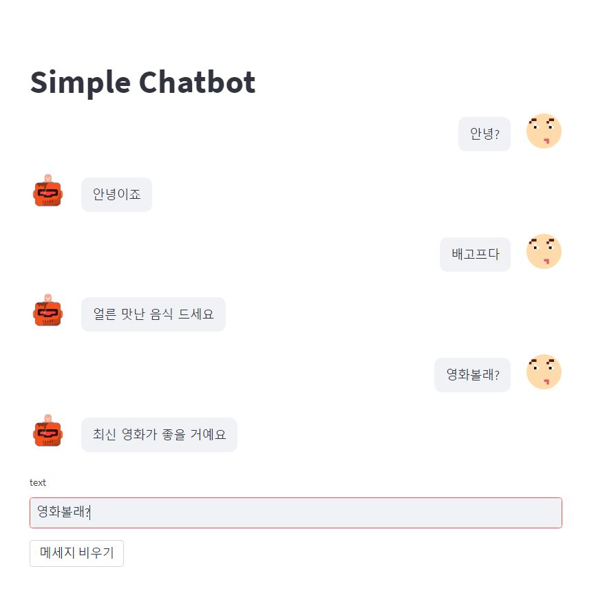

# Streamlit 프로젝트
------------
## 1일차 진행사항
- streamlit으로 웹 구성
<<<<<<< HEAD
- 채팅봇 모델 탐색
- streamlit_chat 채팅봇 UI 구성

## 2일차 진행사항
- skt koGPT2를 활용한 채팅봇 모델 탐색 및 학습 (코드 출처 : https://wikidocs.net/157001)
- streamlit-chat을 활용한 채팅봇과 간단한 대화기능 구성

